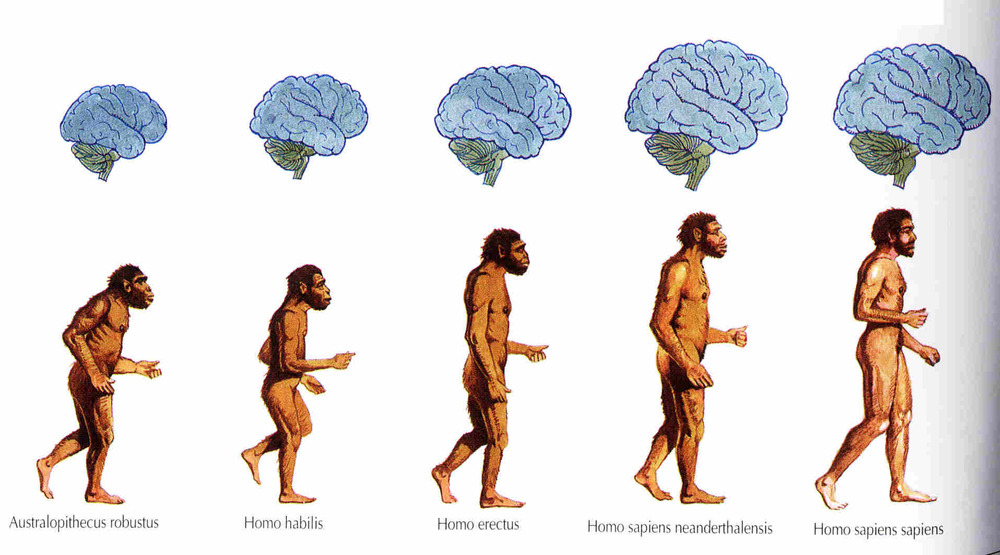

# antifragile
Self-reorganizing mechanism arising from recursive axiom collapse within multi-layer inference automata grounded in the FEP.

For intelligence to be artificial, it must take this form.

  

